# Use Case 3: The Real-Time Healthcare Alert

## 1. Overview

This use case demonstrates the challenges of reliable message delivery in a critical, real-time streaming scenario. We will explore why **At-Least-Once** delivery is non-negotiable for life-critical data and simulate the new problem it introduces: message duplication. The goal is to understand why building an **idempotent consumer** is the essential second half of a reliable messaging system.

---

## 2. Context and Scenario

A high-risk patient is wearing a real-time heart monitor. The monitor detects a "Critical Arrhythmia Event." It must immediately send an alert to the nurses' station.

For each event:
    1.  The central server **must** receive an alert message from a device.
    2.  The system **must not** send multiple notifications to staff for the same single cardiac event.

Delivery guarantees:
    1.  **Reliability**: The system must be resilient to network instability (e.g., Wi-Fi/cellular dropouts).
    2.  **Scalability**: The system must be able to handle alerts from thousands of concurrent devices as the hospital expands its monitoring program.
    3.  **Durability**: Once an alert is sent, it should be stored durably until it is successfully processed.

---

## 3. Experiment Purpose

The purpose is to practically demonstrate:
1.  The catastrophic failure of **At-Most-Once** delivery in a critical system.
2.  How **At-Least-Once** delivery solves the reliability problem by ensuring the message arrives.
3.  The side-effect of At-Least-Once semantics: the creation of duplicate messages under specific failure conditions.
4.  The critical need for the consumer (the server) to be idempotent to handle these duplicates safely.

## 4. Architecture Variants

### Stage 1: The Database-First Approach

**Goal**: Demonstrate the transactional safety and the brittleness of using a database as a message queue.

*   **Architecture**:
    *   **Producer**: A k6 script simulating a heart monitor.
    *   **Backend**: A backend service that exposes an HTTP endpoint. 
    *   **Database**: A PostgreSQL database with the `pgmq` extension.
    *   **Alerrting Service**: A service that polls the `pgmq` table.

```mermaid
architecture-beta
    group streaming(cloud)[IoT]

    service producer(client)[k6] in streaming
    service backend(server)[API Backend] in streaming
    service queue(database)[Postgres] in streaming
    service alerting(server)[Backend] in streaming

    junction junctionCenter

    producer:R --> L:backend
    backend:R --> L:queue
    queue:R --> L:alerting
```



*   **Semantic**: **Transactional "Exactly-Once"** -> This provides strong consistency *at the database level*.

*   **The Experiment**:
    1.  Generate a low, steady workload from the producer (e.g., **30-60 RPS**).
    2.  The TPS rate should be equivalent to the RPS one.
    3.  Introduce network latency (e.g., 200ms) between the **backend** and the **database**.

*   **Expected Results & Key Takeaway**:
    *   `rate(http_req_failed) > 0`: The rate of failed requests will increase significantly as producers experience timeouts.
    *   `p(95) of http_req_duration`: Will spike well above the injected 200ms latency due to transaction queuing and contention at the database.
    *   `p(95) of db_insert_latency_ms`: The percentile latency for the `INSERT` query itself will increase due to locking and resource waits.
    *   `p(95) of db_read_latency_ms`: The consumer's polling query (`SELECT` from `pgmq`) will slow down, indicating index degradation and contention from the high write load.
    *   `rate(db_tps)`: The overall database transaction-per-second rate will fall as each transaction is held open longer, reducing system throughput.
    *   **Takeaway**: The synchronous architecture is brittle. Latency in the database directly impacts the producer, making the database a single point of contention and failure for the entire system.

---

### Stage 2: Decoupling with a Broker (At-Most-Once)

**Goal**: Show how a message broker improves system stability and resilience to network issues, while exploring the simplest delivery semantic.

*   **Architecture**:
    *   **Producer**: The heart monitor service now publishes messages to a RabbitMQ broker using the **MQTT** protocol.
    *   **Broker**: RabbitMQ with the MQTT plugin enabled.
    *   **Consumer**: A service subscribes to the MQTT topic on RabbitMQ.

```mermaid
architecture-beta
    group streaming(cloud)[IoT]

    service producer(client)[k6] in streaming
    service broker(broker)[RabbitMQ] in streaming
    service consumer(server)[Backend] in streaming

    producer:R --> L:broker
    broker:R --> L:consumer
```



*   **Semantic**: **At-Most-Once (MQTT QoS 0)**. The producer "fires and forgets" the message. It does not require an acknowledgment from the broker.

*   **The Experiment**:
    1.  Run the same workload (**30-60 MPS**) as Stage 1.
    2.  Introduce network interference (e.g., 10% packet loss) between the **consumer** and the **broker**.

*   **Expected Results & Key Takeaway**:
    *   `rate(producer_sent_msgs)`: Will remain stable at the target rate. The producer is unaffected by downstream issues.
    *   `rate(consumer_received_msgs)`: Will be approximately 10% lower than the producer's send rate, demonstrating permanent message loss.
    *   `p(95) of producer_latency_ms`: Will remain low and stable. Since QoS 0 is "fire and forget," the producer doesn't wait for any acknowledgment, making it fast and resilient to network issues from its perspective.
    *   **Takeaway**: Decoupling with a broker provides excellent system stability and producer performance. However, "At-Most-Once" is unacceptable for critical data because it offers no delivery guarantee, leading to silent data loss during network disruptions.

---

### Stage 3: Guaranteeing Delivery (At-Least-Once + Idempotency)

**Goal**: Build a robust, horizontally scalable architecture capable of handling a massive ingestion rate that would overwhelm a database.

*   **Architecture**:
    *   **Producer**: A 50 worker script simulating heart monitors publishing from multiple users.
    *   **Broker**: RabbitMQ is configured to route all incoming MQTT messages directly into a **RabbitMQ Stream**.
    *   **Consumers**: A group of "worker" services (a Kubernetes Deployment with multiple replicas). Each worker is an independent consumer that reads from the RabbitMQ Stream, tracks its own offset, and writes batches of data to a database.


*   **Semantic**: **At-Least-Once + Idempotent Consumer**.
    *   The broker guarantees messages in the stream will be delivered at least once.
    *   The consumer workers are designed to be idempotent. They use the unique `event_id` from the message to handle duplicates, typically by using an `INSERT ... ON CONFLICT` (UPSERT) command when writing to the database.

*   **The Experiment**:
    1.  Generate a very high workload (e.g., 2k messages/second) that would cause severe contention and performance degradation in the Stage 1 database architecture.
    2.  Start with a single consumer worker pod and ramp up the producer workload from **60 to 200 MPS**.
    3.  Observe the consumer lag building up in the RabbitMQ stream.
    4.  Scale the number of consumer "worker" pods from 1 to 4.

*   **Expected Results & Key Takeaway**:
    *   `gauge(rabbitmq_stream_consumer_lag_messages)`: Will increase rapidly when only one consumer is active, showing that processing can't keep up with ingestion.
    *   `rate(db_tps)`: With one consumer, this rate will be limited by a single writer's capacity. After scaling to 4 consumers, this rate should increase ~4x.
    *   `p(95) of producer_latency_ms`: Will remain low and stable throughout. The producer is fully decoupled and unaffected by the consumer-side processing lag.
    *   **Takeaway**: By using a stream as a durable buffer, the system can handle ingestion rates far beyond the capacity of a single database writer. The competing consumers pattern allows processing throughput to be scaled horizontally by adding more consumer instances. This effectively decouples the ingestion rate from the processing rate, preventing producer backpressure and allowing the system to catch up from processing lags by scaling consumers independently.


## Steps To Reproduce

This use case will be implemented using the following components:

*   **Spin up the dependencies**: A `task heathcare:deploy` command will deploy the required services to run the experiments.
*   **Run the backend**:
    *   A Go application with different entry points for each stage's producer and consumer logic.
    *   A network proxy tool (like `toxiproxy`) will be used to simulate network interference between the backend and its dependency (PostgreSQL in Stage 1, RabbitMQ in Stage 2).
*  **Check the status**
*  **Run the 1st stage first**
*  **Examine the metrics in Grafana**
*  **Play with configurations for toxiproxy**
*  **Reset the environment**
*  **Run the 2nd stage**
*  **Examine the metrics in Grafana**
*  **Reset the environment**
*  **Run the 3rd stage**
*  **Examine the metrics in Grafana**
```
